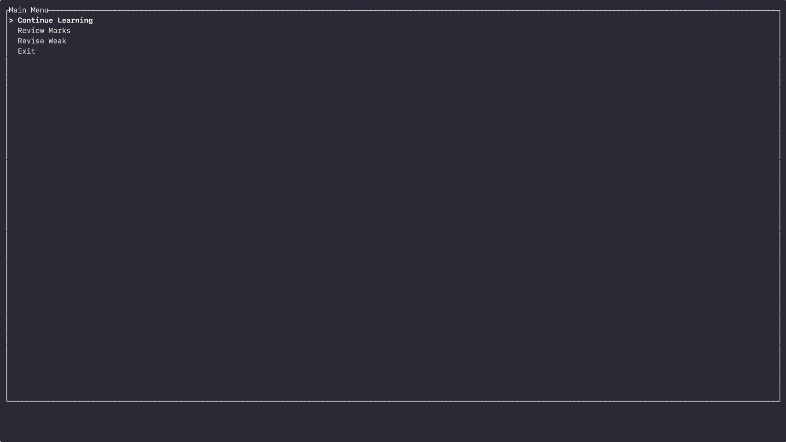

# vocabulator


A keyboard-driven TUI for deliberate vocabulary practice.  
Runs locally with SQLite, keeps progress between sessions, and stays fast by avoiding unnecessary abstraction.

## Demo



Terminal recording: [demo.cast](assets/demo.cast)

Replay:

```bash
asciinema play assets/demo.cast
```

## Features

- Practice by group, marked, or weak words
- Resume sessions with saved position
- Tracks exposure, success rate, and last seen timestamps
- Lightweight, offline-first design

## Installation

```bash
git clone https://github.com/AnshUjlayan/vocabulator
cd vocabulator
cargo run --release
```

[](LICENSE)
